### AWS PROJECT: Setup A Highly Available Nginx Web Servers In a Private VPC
***
## Prerequisite
* AWS account
***

## Project Work Flow
* Create a VPC with two private and public subnet for high availability
* Set up 2 EC2 instances on AWS
Deploy an Nginx web server on these instances
* Set up an ALB(Application Load balancer) and a Domain name to route requests to your EC2 instances
* Make sure that each server displays its own Hostname or IP address. You can use any programming language of your choice to display this.
* Your Instances should not be assigned public IP addresses.

## Step1
* Create a vpc with the following details
  * vpc name: `afz-altschool-cha-vpc`
  * VPC range: `10.0.0.0/16`
  * VPC region: `us-east-1`
  * Enable `DNS hostnames` and `DNS resolution`
  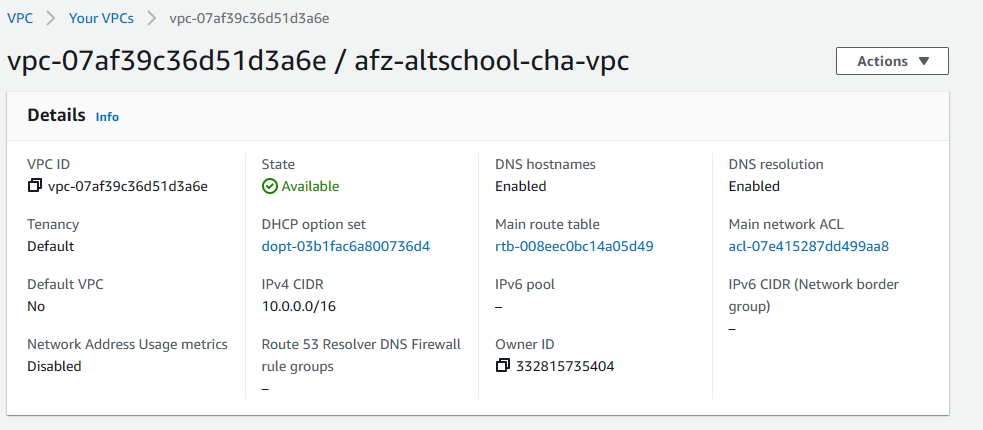

* Create four subjects in the vpc
  * 10.0.0.0/24    => pub-sub1 `us-east-1a`
  * 10.0.1.0/24    => pub-sub-2 `us-east-1b`
  * 10.0.2.0/24    => priv-sub-1 `us-east-1a`
  * 10.0.3.0/24    => priv-sub-2 `us-east-1b`
  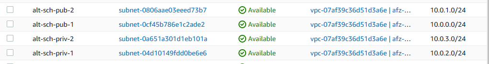

* Create an Internet Gateway and attach to the VPC created earlier
  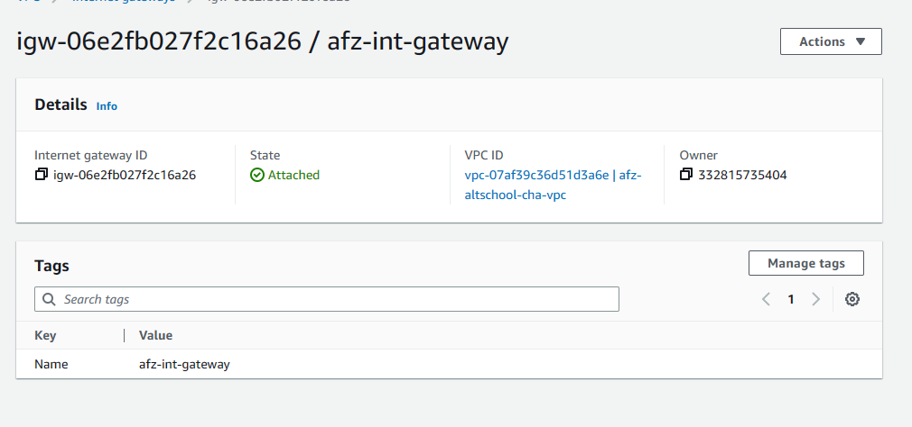

* Create a NAT gateway in a the public subnet and allocate an Elatic IP.
  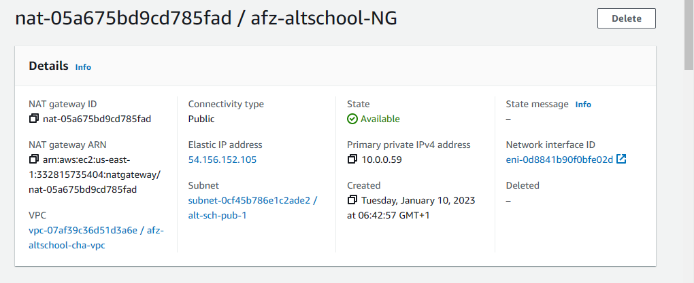

* Now, we'll be creating two route tables for the public and private subnets
  * Select the two public subnets for this Route Table
  * Click on the `edit routes` of the public Route table and to allow `0.0.0.0/0` from the internet gateway. This is what makes your subnet a public subnet.
  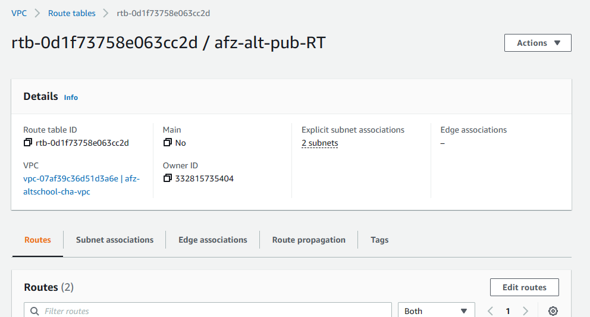
  * Select the two private subnets for this Route table
  * Select the `edit routes` and allow `0.0.0.0/0` using the NAT gateway. This is what makes your subnet a private subnet.
  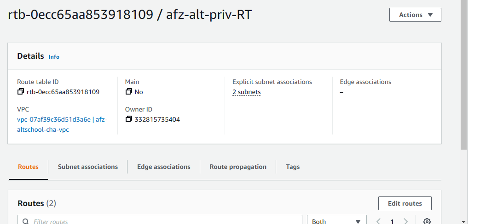
* 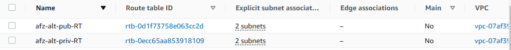

## Step2: Create the EC2 instance in the private subnets
* Launch an instance with the following attributes
  * Create a name for the first web server, for our project, i'll be using `web01`
  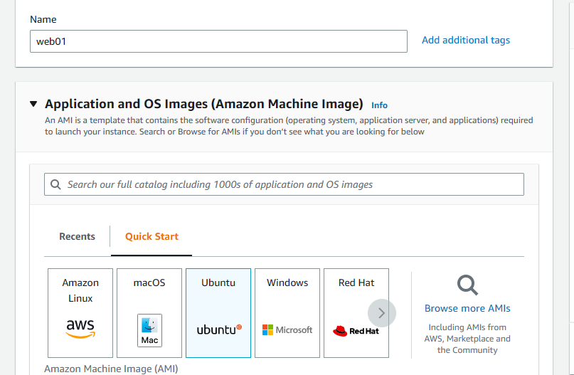
  * Select the vm, we'll be selecting the `ubuntu server 22.04` for our project.
  * Select the instance type, here we'll be using the `t2.micro` `free eligible tier`
  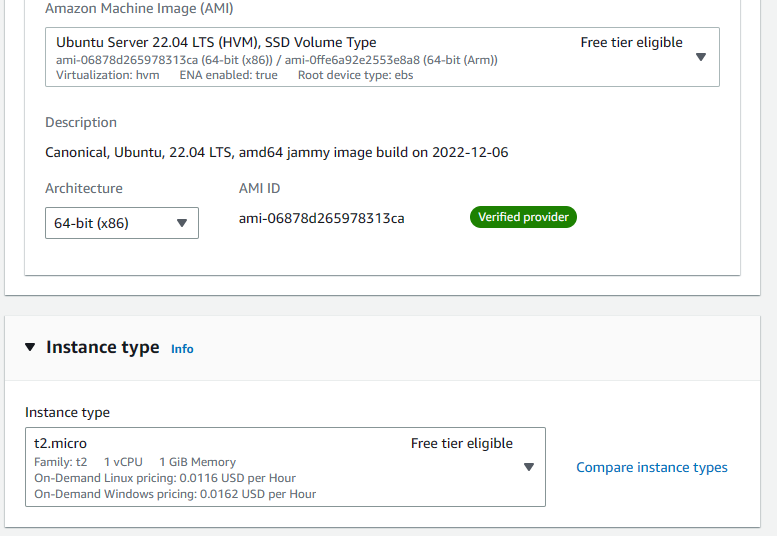
  * Edit the `network setting` to select the custom VPC, select a private subnet as this would be deployed in a private subnet and create a security group. (for now allow ssh)
  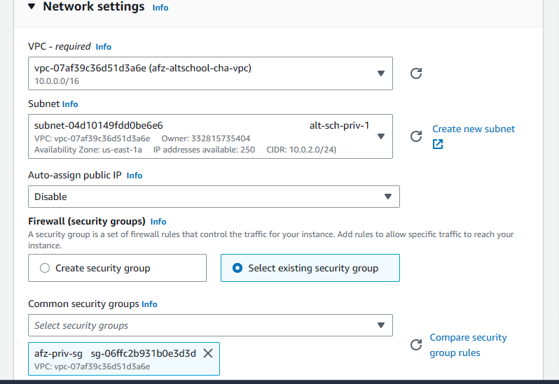
  * Add the content of the [script.sh](script.sh)
 to the user data then launch the instance

* Follow the step above for the second web server, except in this case, change the `hostname` in the [script.sh](script.sh) so as to differentiate each webserver.
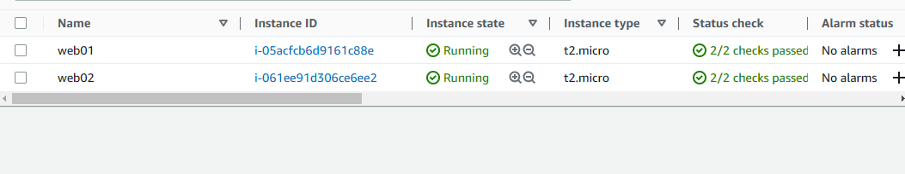

## Step3: Let's create our Load balancer
Note: For our project, we'll be using an application load balancer.
* Create a target group for your load balancer
  * Select `instances` as the target type
  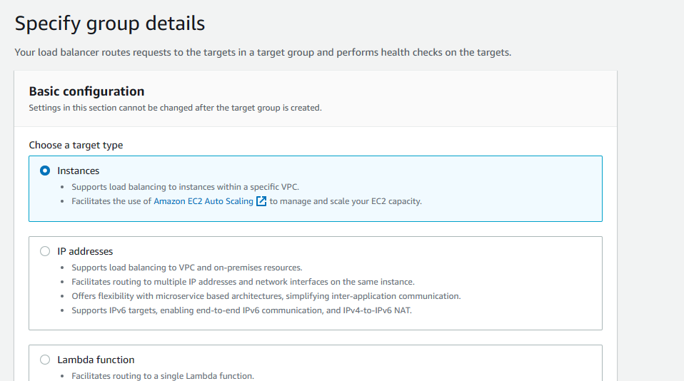
  * create a target group name and select the following attributes as seen in the image below;
  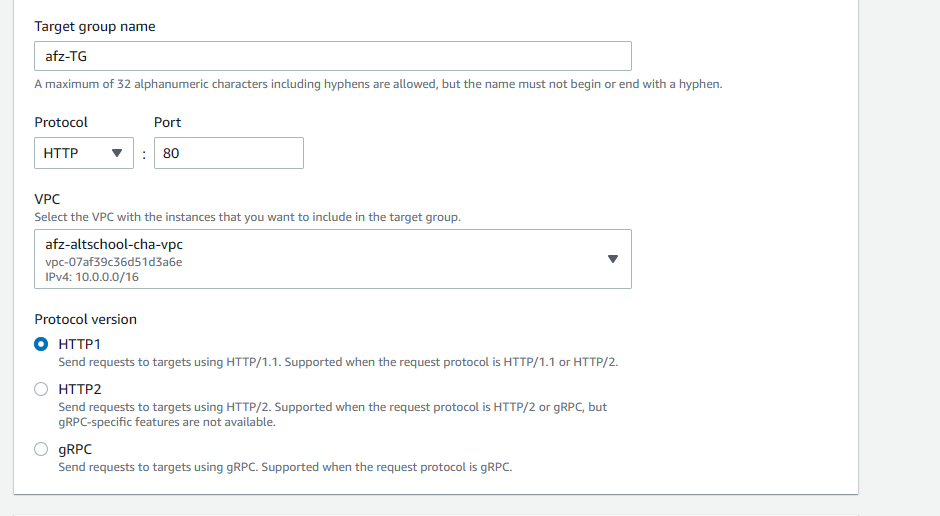
  * Select the `http protocol` and `path` as shown below;
  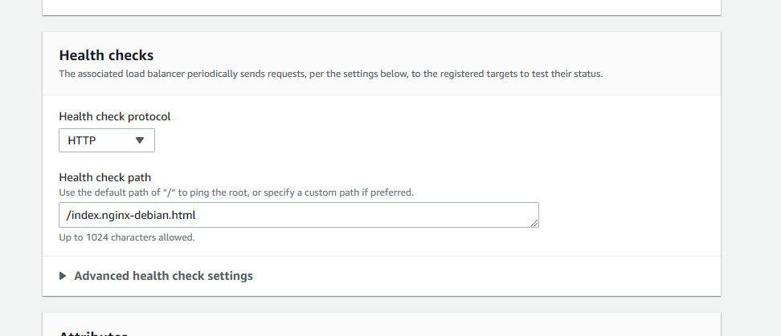
  * click next and select the two web instances then click on `include as pending below` then create the target group.
  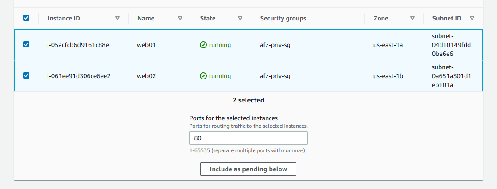
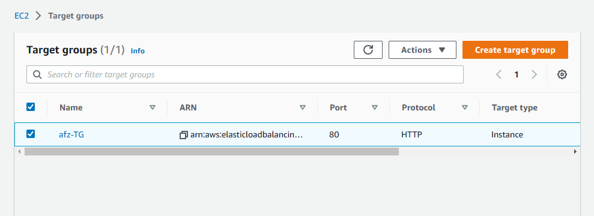
* Create the Load balancer 
  * Select the application load balancer
  * select a load balancer name
  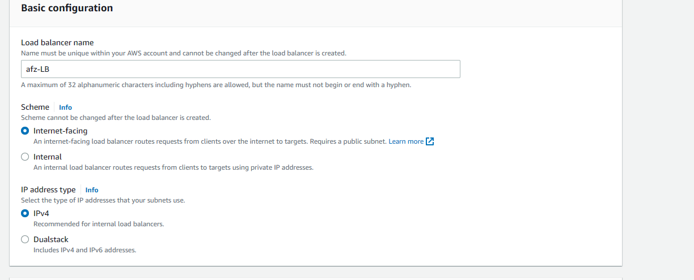
  * Select the custom vpc and availability zones in the public subnet
  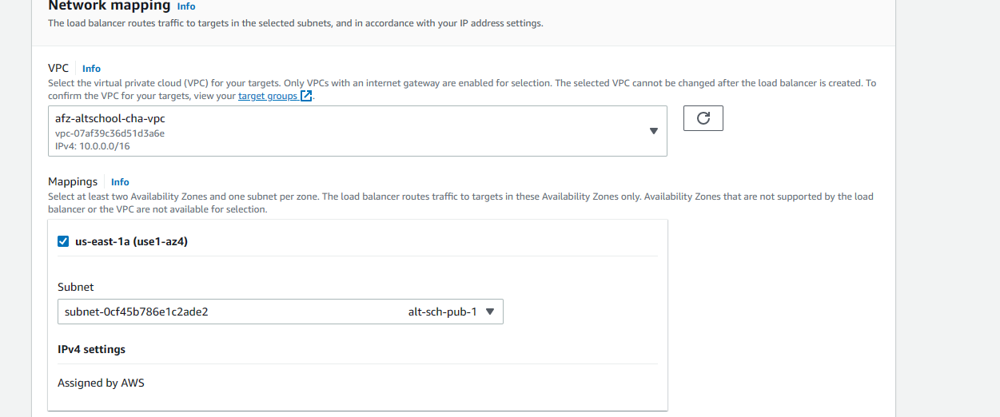
  * Create a security group that allows port 80 from `0.0.0.0/0`
  * Select the target group created earlier in the listener then create the load balancer.

## Validation
Now we can copy the load balancer url/endpoint when it is active and paste in our browser to verify our setup.
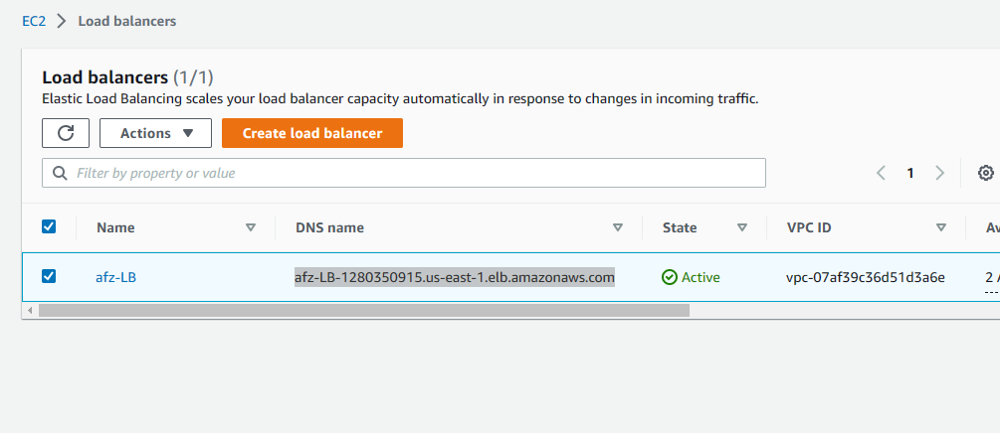
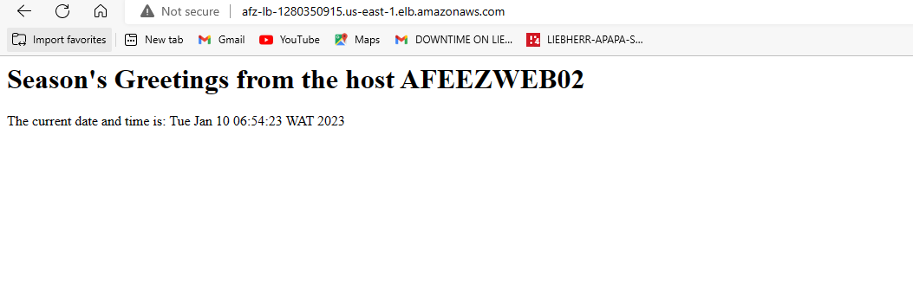
Refresh the page to validate the second server
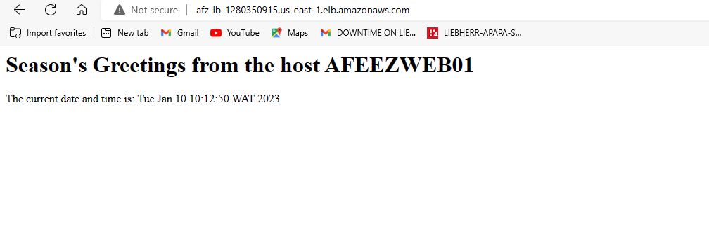

Congrats!!! You have successfully deployed an nginx web server in a private vpc.
* NOTE: ***This is a manual deployment, we would be automating this deployment with ansible in the next blog. THANKS***